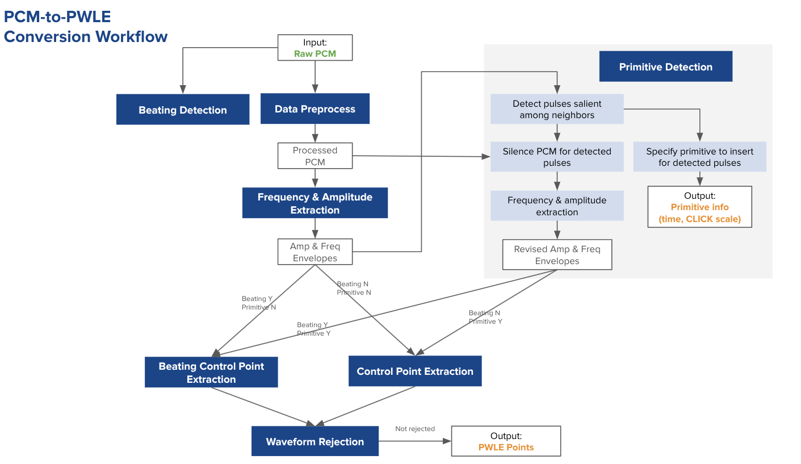
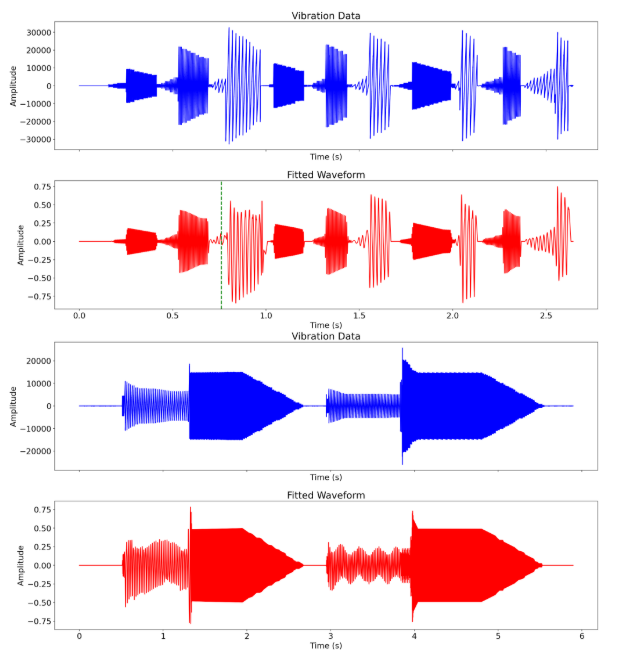
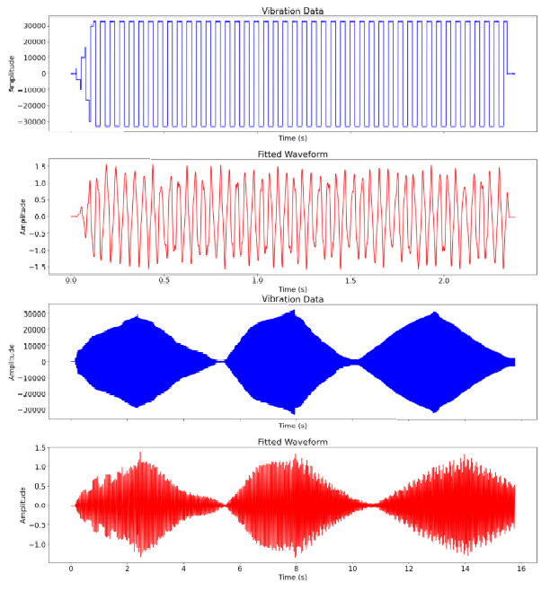
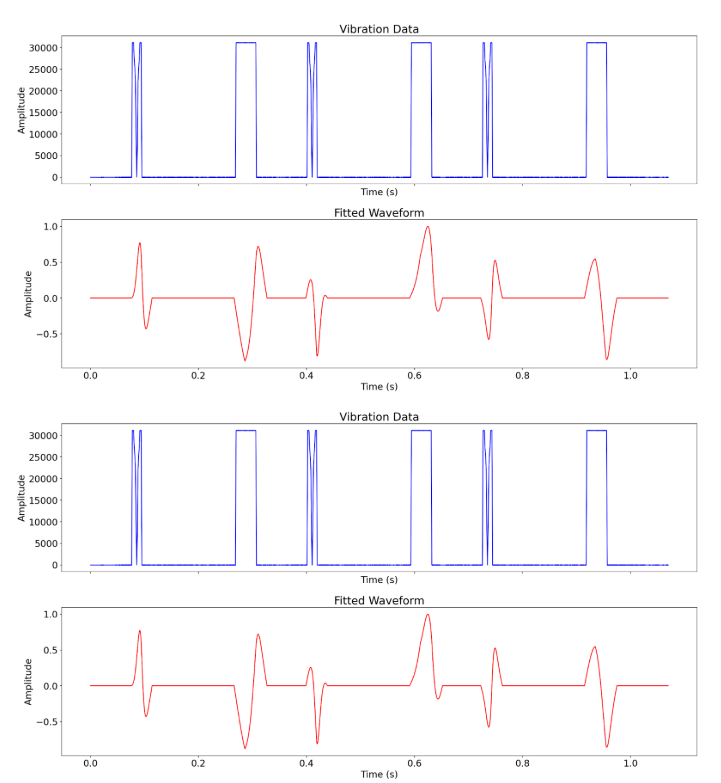
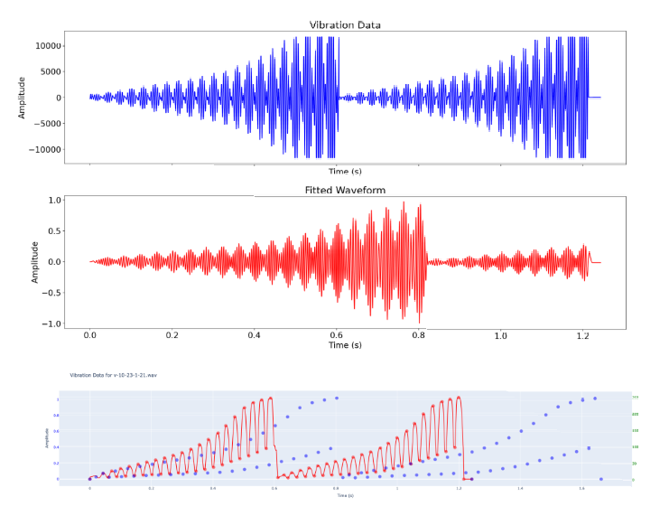

# PCM to PWLE Conversion Tool

### Downloads
You can download the latest pre-compiled executables for your platform from the [Releases](https://github.com/android/haptics-tools/releases/latest) page:

| Platform | Download |
| :--- | :--- |
| **Linux** | [Download for Linux](https://github.com/android/haptics-tools/releases/latest/download/pcm_to_pwle-ubuntu-latest) |
| **Windows** | [Download for Windows](https://github.com/android/haptics-tools/releases/latest/download/pcm_to_pwle-windows-latest.exe) |
| **macOS** | [Download for macOS](https://github.com/android/haptics-tools/releases/latest/download/pcm_to_pwle-macos-latest) |

### Background

PCM (Pulse-Code Modulation) is a low-level digital representation haptic
waveform format that specifies the amplitude of the vibration at a given
sampling rate. The PCM haptic effects are highly dependent on specific hardware
and are hard to be ported across different devices.

PWLE (Piecewise-Linear Envelope) describes the envelope of the vibration using a
series of control points. Each control point specifies a target amplitude and
frequency at a particular point in time. Haptics HAL then uses these control
points to generate a waveform that is optimized for its specific hardware
capabilities while still adhering to the designer's intent.

PWLE is a more abstract, concise and flexible format for defining haptics
effects that is not tied to a specific type of hardware, and it will be an
essential part of the standard Android haptics file format.

The PCM to PWLE conversion tool converts arbitrary PCM haptic effects to PWLE
based haptics format without introducing perception distortion. It helps
designers auto convert PCM format to portable haptics format, achieving the
goal: design once, play everywhere.

### How to use the tool

Commandline examples for generating PWLE based haptics files:

```
$ pcm_to_pwle wav_files/v-10-23-1-21.wav test_pwle1.json
```

```
$ pcm_to_pwle --haptic_type=advanced_pwle_haptic ogg_files/bumps.ogg test_pwle2.json
```

Add `--loglevel` if you want to dump and inspect internal logs:

```
$ pcm_to_pwle wav_files/v-10-28-7-36.wav test_pwle3.json --loglevel=INFO
```

### Algorithm

{width="800"}

#### Input
The input of the tool is a raw PCM. Currently, we only support
[WAV](https://en.wikipedia.org/wiki/WAV) file (assuming haptics data stored in
the 1st channel) and [OGG](https://en.wikipedia.org/wiki/Ogg) file (assuming the
haptics data stored in the 2nd channel). The tool throws an error if the file
extension is not `wav` or `ogg`.

#### Output

The output of the tool is a PWLE based json.

[BasicPWLE](https://developer.android.com/reference/android/os/VibrationEffect.BasicEnvelopeBuilder)'s
control points are tuples of (`sharpness`, `intensity`, `duration`).

*   Different devices have different minimum frequency, maximum frequency, and
    resonant frequency that affects the basic PWLE frequency value mapping.
    Users can specify a frequency profile (`min_f`, `res_f`, `max_f`) via flags.

*   PCM amplitude is normalized to [0, 1] and directly used as basic PWLE
    intensity.

[AdvancedPWLE](https://developer.android.com/reference/android/os/VibrationEffect.WaveformEnvelopeBuilder)'s
control points are tuples of (`frequency`, `amplitude`, `duration`).

*   PCM frequency is directly used. It's user's responsibility to set the right
    frequency as the frequency may be outside of the supported frequency range
    of the target device.

*   Assume PCM amplitude is normalized to [0, 1] and directly mapped to
    `amplitude` as normally designers treat PCM amplitude as intensity instead
    of driving voltage during their designing.

#### Beating detection

*   Beat frequency in [`1 Hz`, `6 Hz`]: won’t be detected as beating (FFT is
    smoothed for detection robustness), will be converted using the main
    conversion path

*   Beat frequency in [`6Hz`, `25 Hz` (1000 / (2 * min_duration))]: will be
    detected as beating, and go though the beating conversion path.

*   Beat frequency > `25 Hz` (1000 / (2 * min_duration)): will be rejected
    together since it exceeds the min duration between points in PWLE
    definition.

#### Primitive detection

*   If a primitive is detected, its start and end will be calculated. PCM data
    within the primitive’s time duration will be silenced before PWLE control
    points extraction.

*   The primitive insert time will be the start time of the detected primitive's
    range. For detected primitives, `CLICK` primitive is called with scaling.

**NOTE** Right now, the tool only supports the detection of primitives isolated
from continuous waveforms. Basically primitives among silence periods. It
currently does not support the detection of primitives overlapped with
continuous waveforms.

### Flags

We expose the following flags for advanced users to tweak the algorithm's
behavior:

*   `haptic_type` specifies whether to output BasicPWLE (when
    `--haptic_type=basic_pwle_haptic`) or AdvancedPWLE (when
    `--haptic_type=advanced_pwle_haptic`). Defaults to `basic_pwle_haptic`.

*   `freq_profile` is a tuple of (`min_f`, `res_f`, `max_f`). Defaults to `(50,
    136, 174)`, if the target device's frequency profile is unknown.

*   `jnd_multiple` stands for
    [just-noticeable difference](https://en.wikipedia.org/wiki/Just-noticeable_difference)'s
    multiplier. It's used in control point extraction. Defaults to `-1.0`, which
    uses half of the `MIN_DURATION`, the minimum duration for neighboring
    control points.

*   `error_threshold`, the error threshold for
    [Ramer-Douglas-Peucker](https://en.wikipedia.org/wiki/Ramer%E2%80%93Douglas%E2%80%93Peucker_algorithm)
    algorithm. Defaults to `0.01`.

*   `pulse_to_neighbor_ratio`, the sensitivity threshold for detecting pulses. A
    pulse is detected if its magnitude is `pulse_to_neighbor_ratio` times
    greater than the minimum magnitude of its neighbors. Therefore, a larger
    value makes the detection less sensitive (fewer points), while a smaller
    value makes it more sensitive (more points). Defaults to `5`.

*   `primitive_amp_ratio_threshold`, the amplitude threshold ratio used in
    primitive detection. Defaults to `0.1`.

*   `primitive_freq_threshold`, the frequency threshold used in primitive
    detection. Defaults to `50`.

*   `crop_s`, the number of seconds to crop from the beginning of the PCM data.

### Bad cases and warnings

The tool emits warning messages like below when encountered bad cases.

```
WARNING: max_time_shift 347.10813378320836 >  100
```

```
WARNING: beating_freq 34.59012805078254 > 25.0
```

In such instances, the generated PWLE may not fit well with the original PCM,
leaving it to the user's discretion whether to accept the resulting output.

In the following charts, the blue curve is the original PCM and the red curve is
the fitted wave.

#### Large distortion
If any extracted control point of the waveform has a time shift larger than `100
ms`. It is considered to be a large shape distortion, which means the shape of
the waveform cannot be held in the converted PWLE. Typically, square or sawtooth
carrier waveforms with low frequency have such distortions.

| Sawtooth carrier waveform (freq < 50Hz) | Square carrier waveform (freq < 50Hz) |
| :---: | :---: |
| {width="450"} | {width="450"} |

**Suggestions**:

*   If sawtooth/square carrier waveform is used, switch carrier waveform to sine
    wave.
*   If it is an arbitrary waveform, consider increasing RDP's `error_threshold`
    and `jnd_multiple`.

#### Low mean frequency

The generated PWLE doesn't fit well when the mean frequency is lower than `25
Hz`.

{width="500" style="margin-left: 20px;"}

#### Beating effects

[Beating effects](https://en.wikipedia.org/wiki/Beat_\(acoustics\)) doesn't fit
well when the beat (modulation) frequency is larger than `(1000 / (2 *
min_duration))`.

{width="500" style="margin-left: 20px;"}
