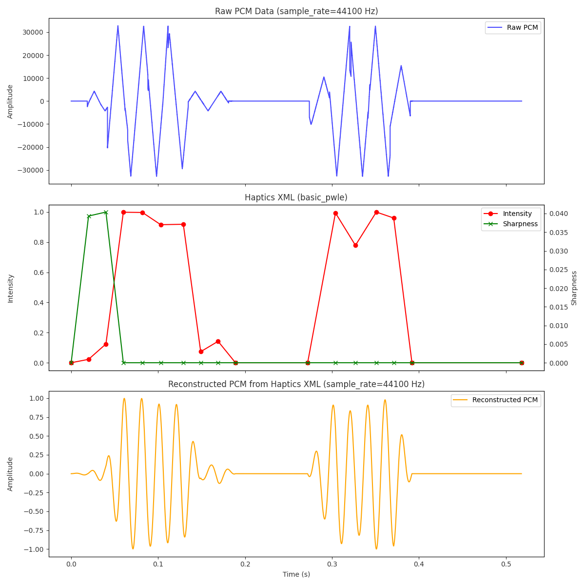

# PCM to PWLE Haptics Toolkit

[](LICENSE)

A toolkit for converting raw PCM haptic effects into Android's PWLE and preset
based haptics format, and visualizing the conversion results.

## Background

**PCM ([Pulse-Code Modulation](https://en.wikipedia.org/wiki/Pulse-code_modulation))**
haptic effects is a low-level digital representation of a haptic waveform that
specifies the exact value of every sample for the haptic module input signal.
PCM effects are highly dependent on specific hardware and are difficult to port
across different devices.

**PWLE ([Piecewise-Linear Envelope](https://source.android.com/docs/core/interaction/haptics/haptics-pwle))**
describes the envelope of a vibration using a series of abstract control points.
Each point specifies a target amplitude/intensity and frequency/sharpness at a
particular point in time. The device's Haptics HAL uses these control points to
generate a waveform optimized for its specific hardware capabilities.

**Preset (formerly known as short primitive)** is a short, precisely damped
physical impulses. They are pre-compiled, hardware-optimized haptic effect
stored directly in the haptic chip's firmware.

This toolkit converts arbitrary PCM haptic effects into the PWLE + preset based
format while minimizing perception distortion. It helps designers automatically
convert hardware-specific PCM data into a portable format.

## Downloads

You can download the latest pre-compiled executables for your platform from the
[Releases](https://github.com/android/haptics-tools/releases/latest) page:

| Platform | Download |
| :--- | :--- |
| **Linux** | [Download for Linux](https://github.com/android/haptics-tools/releases/latest/download/pcm2pwle-ubuntu-latest.tar.gz) |
| **Windows** | [Download for Windows](https://github.com/android/haptics-tools/releases/latest/download/pcm2pwle-windows-latest.zip) |
| **macOS** | [Download for macOS](https://github.com/android/haptics-tools/releases/latest/download/pcm2pwle-macos-latest.tar.gz) |

### Installation & Setup

1. **Extract the archive:** Download the file for your platform and
   extract it. You will find the ready-to-use `pcm2pwle` (or `pcm2pwle.exe` on
   Windows) executable inside.
2. **Run the tool:** You can open your terminal and run it directly from that
   folder.

---

## Usage

The `pcm2pwle` tool provides two primary sub-commands: `convert` and
`visualize`.

### 1. Converting PCM to Android Haptics Format
Use the `convert` command to analyze a `.wav` or `.ogg` file and generate the
output.

*   **WAV files**: Assumes haptic data is stored in the 1st channel if stereo.
*   **OGG files**: Assumes haptic data is stored in the 2nd channel.

#### Basic Examples
```bash
# Convert using the default Basic PWLE format
$ ./pcm2pwle convert --pcm wav_files/effect.wav --output result_basic.xml

# Convert using the Advanced PWLE format
$ ./pcm2pwle convert --pcm ogg_files/bumps.ogg --output result_advanced.xml \
    --pwle_type advanced_pwle
```

#### PWLE Types

*   `basic_pwle` (Default): Outputs control points as (`sharpness`,
    `intensity`, `duration`). PCM amplitude is mapped to intensity. PCM
    frequency is mapped to sharpness based on the `--freq_profile` of the device
    that the PCM is designed for,.
*   `advanced_pwle`: Outputs control points as (`frequency`, `amplitude`,
    `duration`). PCM data is mapped directly.

#### Advanced Tuning Flags
You can tweak the conversion algorithm using various flags. Use
`./pcm2pwle convert --help` to see all available options.

*   `--freq_profile`: A tuple of minimum, resonant, and maximum frequencies of
    the design device. Defaults to `50 136 174`. Used for `basic_pwle`
    sharpness mapping.
*   `--amp_ratio_threshold`: the amplitude threshold ratio used in preset
    detection. Defaults to `0.05`.

### 2. Visualizing Haptics
Use the `visualize` command to inspect raw PCM data, generated PWLE / presets
and the reconstructed waveform.

#### Examples
```bash
# View raw PCM data only
$ ./pcm2pwle visualize --pcm wav_files/effect.wav --output vis.png

# View converted PWLE / presets and how they reconstruct into a waveform
$ ./pcm2pwle visualize --pwle result.xml --output vis.png

# Compare the original PCM directly against the PWLE / presets reconstruction
$ ./pcm2pwle visualize --pcm wav_files/effect.wav --pwle result.xml \
    --output vis.png
```

{width="600"}

---

## Unsupported Scenarios
The tool will emit `WARNING` logs if it encounters waveforms that cannot be
accurately represented in the PWLE format:

*   **Dense modulation**: If the PCM effect has an amplitude modulation too
    dense, it will be rejected due to large temporal distortion; if the PCM
    effect has a frequency modulation too dense, large modulation distortion may
    occur, and the tool gives a warning.
*   **Frequency Below Hardware Limits**: PCM effects with low frequencies
    (< 25 Hz) are not recommended as input, as they generally fall below the
    supported frequency range of standard actuator hardware.
*   **High-Frequency Beating**: Beating effects where the modulation frequency
    exceeds `1000 / (2 * `[`min_duration`](https://developer.android.com/reference/android/os/vibrator/VibratorEnvelopeEffectInfo#getMinControlPointDurationMillis())`)` does not
    fit well by PWLE.
