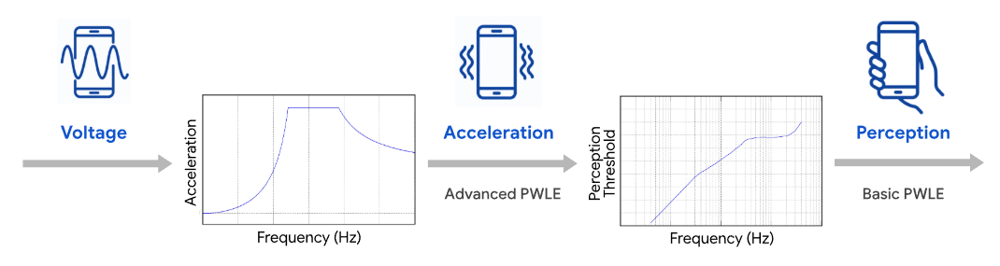

# Android Haptic PCM to PWLE Conversion Algorithm

## Background

Pulse-code modulation (PCM) is a common representation for haptic effects
given its design flexibility and easy access as a general waveform file format.

However, PCM haptic waveforms are not portable across devices. Since it directly
stores the waveform samples, it is difficult to modify. For example, a PCM
waveform designed for a device with one resonant frequency cannot be easily
modified for a device with another resonant frequency. Moreover, the large
hardware variations across Android devices (e.g., frequency/amplitude operating
ranges, frequency response profiles) means that a carefully designed PCM
waveform that plays well on one device may exhibit significant distortion when
played on another device. Consequently, the vibration pattern might not be
recognizable or even cause damage to the actuator during playback.

Furthermore, PCM haptic waveforms are unintuitive to interpret. They typically
define the haptic pattern in the voltage space, but because both the actuator's
acceleration response and human perception of vibration intensity are
inherently nonlinear with respect to frequency, there is a complex nonlinear
mapping between the voltage signal amplitude and its perceived intensity. This
nonlinearity makes it difficult for users to accurately predict the tactile
perception of their designed waveforms.

*Illustration of the relationship between input voltage, output acceleration,
and human perception of vibration.*

As PCM stores the whole sequence of waveform samples with high sampling rate,
it also introduces file format complexity, and storage and transmission
inefficiency.

On the other hand, [Android Piecewise linear envelope (PWLE) effects][pwle-docs]
offer a compact, normalized, and parametric representation in perceptual space
([basic PWLE][basic-pwle-api]), and adapts to the specifications of the
hardware it is played on.

Currently, there is no tool that can convert PCM haptic effects to PWLE to
mitigate the limitations of the PCM representation and to take advantage of the
benefits of PWLE. This document details the PCM to PWLE conversion algorithm
developed to address this gap.

## Algorithm Overview

The algorithm converts PCM haptic waveforms into PWLE representations, and
preserves the intended haptic design as much as the device supports.
Specifically, the algorithm simplifies PCM waveforms containing
sample-by-sample variations into waveforms with piecewise linear envelopes in
frequency and amplitude. The waveforms are simplified to comply with the
[Android minimum PWLE segment duration][min-duration-doc] constraint while
minimizing perceivable distortion by leveraging human tactile perception
properties.

The simplified waveform can be represented as a PWLE by using the vertices of
the envelopes as the control points. Both [basic][basic-builder-doc] and
[advanced][advanced-builder-doc] PWLE effects are supported in the output,
which enables different use cases (see
[Algorithm Input and Output](#algorithm-input-and-output)).

This algorithm also supports detecting transient effects within the PCM and
replacing them with [Android primitives][primitives-doc] to preserve their
perception.

## Algorithm Input and Output

### PCM + Device Frequency Profile → Basic PWLE

If basic PWLE is chosen as the output, the frequency profile (F_min, F0,
F_max) of the device that the PCM waveform is designed for is needed as input.
Here, F0 is the device's resonant frequency, F_min and F_max refer to the lower
and upper bounds of its [basic PWLE frequency range][foam-basic-doc]. A default
frequency profile is provided, i.e., (F_min = 50 Hz, F0 = 130 Hz,
F_max = 300 Hz), based on a premium Android device.

Using the input frequency profile, the frequencies of the control points
extracted from the PCM waveform (described below) are mapped to basic PWLE
sharpness values as follows:

1. Frequencies lower than F_min are clipped to F_min and mapped to sharpness 0
2. Frequencies higher than F_max are clipped to F_max and mapped to sharpness 1
3. Frequencies in [F_min, F0] are linearly mapped to sharpness [0.0, 0.7]
4. Frequencies in [F0, F_max] are linearly mapped to sharpness [0.7, 1.0]

The normalized amplitudes of the control points extracted from the PCM waveform
are directly mapped to basic PWLE intensities, which are in the perceptual
space instead of the voltage space. The basic PWLE effect and the original PCM
waveform are likely to feel different when played back on the same device. This
is because the actual waveform of a basic PWLE effect during playback is
calculated at runtime to compensate for the nonlinear
[frequency to output acceleration mapping (FOAM)][foam-advanced-doc] of the
device and the nonlinear
[human vibrotactile perception threshold][threshold-doc] curve, and
therefore becomes different from the original PCM waveform.

As noted before, a complex nonlinear mapping exists between the voltage
amplitude and the perceived intensity. However, this nonlinear relationship and
its calculation are not yet widely recognized among developers and designers.
It is common and natural for the majority of them to expect the perception of
the vibration to linearly correlate with the waveform pattern, which is rarely
true for LRA devices. Therefore, directly mapping PCM waveform amplitudes into
basic PWLE intensities provides a practical way to bridge this discrepancy.

**Recommended Use Cases:**

* Converting PCM waveforms designed or imported with the intention that their
  amplitudes represent perceived vibration intensities in a linear manner.
* Converting PCM waveforms that represent physical accelerations or designed
  for broadband actuators with flat frequency responses.

### PCM → Advanced PWLE

A frequency profile is not needed if choosing to output advanced PWLE. The
frequencies of the control points extracted from the PCM waveform (described
below) are directly used as advanced PWLE frequencies.

The normalized amplitudes of the control points extracted from the PCM
waveform are directly mapped to advanced PWLE amplitudes, i.e., accelerations
normalized relative to the FOAM. The advanced PWLE effect will feel similar to
the original PCM waveform when played back on the same device. This is because
the acceleration normalized relative to the FOAM is a relatively good
approximation of the voltage signal.

Since we respect the frequency values obtained from the PCM waveform and do not
modify them, the output advanced PWLE effects could have control points with
frequencies outside of the supported operating frequency range of a target
device. It is the developer's responsibility to adjust those points to be within
the [supported frequency range][freq-profile-doc] when playing them.

**Recommended Use Case:**

* Converting PCM waveforms that represent the voltage signal to obtain a
  compact, easy-to-edit PWLE representation for further editing or playback on
  a specific device.

## Other Details

### PWLE Control Point Extraction

The amplitude and frequency envelopes of the PCM waveform are derived using the
[Hilbert Transform][hilbert-doc] with pre- and post-processing such as
filtering. Because the PCM waveform is normalized, its global amplitude scale
is not preserved. Candidate amplitude and frequency control points are then
extracted from the amplitude and frequency envelopes, respectively, using the
[Ramer–Douglas–Peucker (RDP) algorithm][rdp-doc].

The obtained candidate control points are further simplified to keep only
perceptually meaningful points and ensure a minimum PWLE segment duration.
Perceptually meaningful points are defined as points whose magnitude (i.e.,
amplitude, frequency, or intensity) difference in decibels with at least one
adjacent point is larger than human vibrotactile perception Just Noticeable
Difference (JND). The Android Framework also requires OEMs that implement PWLE
to support a minimum segment duration of at most [20 ms][min-duration-doc].
Candidate points that do not satisfy the minimum PWLE segment duration
requirement are either removed if they are not perceptually meaningful
(ΔdB < JND), or shifted in time to meet this minimum segment duration if they
are perceptually meaningful (ΔdB ≥ JND). For scenarios where candidate control
points are too dense to satisfy this minimum segment duration requirement,
amplitude control points are prioritized over frequency control points.

### Rejection of Unsupported PCM

Some PCM waveforms are not suitable for LRA playback and are rejected. For
example, a waveform is rejected if:

1. Any extracted control point within the waveform is shifted by more than
   100 ms during the [PWLE control point extraction](#pwle-control-point-extraction)
   process. (Note: This typically rejects waveforms with low-frequency square or
   sawtooth carriers).
2. The waveform has an average frequency lower than the lowest supported
   operating frequency for general LRAs, e.g., 25 Hz.
3. The waveform exhibits beating effects with more than 25 beats per second.

### Transient Effect Detection and Primitive Substitution

Pulses within the waveform are identified based on empirically determined
frequency, amplitude, and duration ranges. A pulse is classified as a transient
effect if it is salient relative to its surrounding waveform segments in both
frequency and amplitude. As a result, detection of transient effects works best
for those isolated from continuous effects.

Since transient effects are short (e.g., ≈ 10 ms), they are muted
within the waveform when detected and replaced by the
[CLICK primitive][click-doc] with its insert time point aligned with the onset of
the detected transient effect and its scale matching the peak amplitude of the
detected transient effect.

[pwle-docs]: https://source.android.com/docs/core/interaction/haptics/haptics-pwle
[basic-pwle-api]: https://source.android.com/docs/core/interaction/haptics/haptics-pwle#basic-pwle-api
[min-duration-doc]: https://developer.android.com/reference/android/os/vibrator/VibratorEnvelopeEffectInfo#getMinControlPointDurationMillis()
[basic-builder-doc]: https://developer.android.com/reference/android/os/VibrationEffect.BasicEnvelopeBuilder
[advanced-builder-doc]: https://developer.android.com/reference/android/os/VibrationEffect.WaveformEnvelopeBuilder
[primitives-doc]: https://source.android.com/docs/core/interaction/haptics/haptics-constants-primitives#implement-primitives
[foam-basic-doc]: https://source.android.com/docs/core/interaction/haptics/haptics-pwle#foam-pwle-api-basic
[foam-advanced-doc]: https://source.android.com/docs/core/interaction/haptics/haptics-pwle#foam
[threshold-doc]: https://source.android.com/docs/core/interaction/haptics/haptics-pwle#human-perception-threshold
[freq-profile-doc]: https://developer.android.com/reference/android/os/vibrator/VibratorFrequencyProfile
[hilbert-doc]: https://en.wikipedia.org/wiki/Hilbert_transform
[rdp-doc]: https://en.wikipedia.org/wiki/Ramer%E2%80%93Douglas%E2%80%93Peucker_algorithm
[click-doc]: https://source.android.com/docs/core/interaction/haptics/haptics-constants-primitives#click
